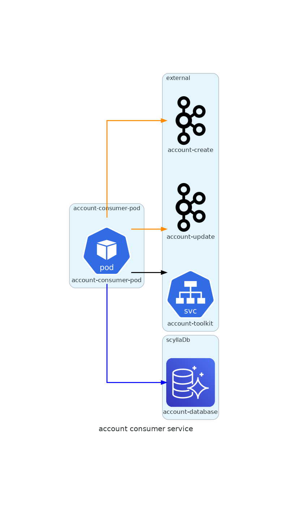

# account-producer-service

## About
Service responsible for:
- Consume account creation, update and deletion messages.

## Technologies
* Golang 1.18

## Development requirements
* Docker Compose
* Visual Studio Code
* DBeaver
* Driver Scylla (https://downloads.datastax.com/jdbc/cql/2.0.11.1012/SimbaCassandraJDBC42-2.0.11.1012.zip)

## Directory Structure
- `build`
     - It has all cloud package, container (Docker), operating system (deb, rpm, pkg) and scripts settings.
- `cmd`
     - It has the `main` function that imports and invokes code from the `/internal` and `/pkg` directories.
- `docs`
     - It has an integration architecture for this API.
- `internal`
     - It has all the code that is not available for import.
- `local-dev`
     - It has all docker configuration.

## Running
- `Docker`
    - Run the following command: make compose-infra-up
- `Create subject kafka`
    - Run the Subjects Create folder from the Postman file available in the directory account-producer-service/resources
- `Config DB`
    - In DBeaver create a new connection with the following settings:
      - JDBC url: jdbc:cassandra://localhost:9042;AuthMech=1;UID=cassandra;PWD=cassandra
      - Host: localhost
      - Port: 9042
      - Username: cassandra
      - Password: cassandra
    - Execute no DBeaver e na conexão criada na etapa anterior, os comandos disponíveis em: account-consumer-service/build/package/docker/scylla/cql/V001_setup.cql
- `Run the project`
    - Run the following command: make run
    - Run some of the requests available in the Postman file API available in the account-producter-service/resources directory
- `View messages sent to Kafka`
    - Access the kafkaui in docker compose -> select Topics -> select the topic -> select Messages
- `Change architecture`
    - If the architecture of this project changes, run the following command in the docs/diagrams directory: make build

## Stop running
- `Stop docker`
    - docker-compose -f local-dev/docker-compose.yaml --profile infra down

## Architecture
